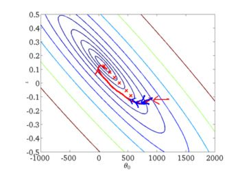
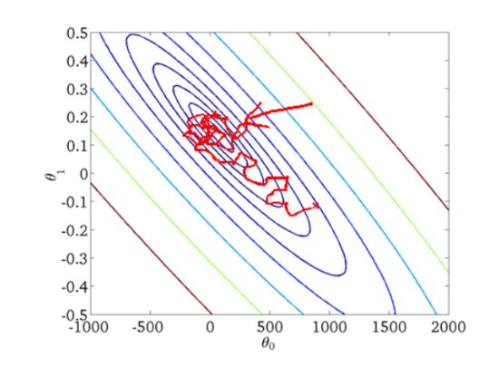

### 梯度下降算法
#### 前言

机器学习的主要任务之一就是通过训练得到一组参数，然后通过损失函数(loss function)来评价这组参数的好坏，因此机器学习的任务就转变成了如何最小化损失函数，而梯度下降(Gradient descent)是最小化损失函数的一种常用方法.

#### 基本概念

- 特征向量(feature vector)：指的是具体的输入实例的向量写法，通常记作：
$$x = (x^{(1)}, x^{(2)}...,x^{(n)})^T$$注意，\(x^{(i)}\)与\(x_i\)不同，\(x^{(i)}\)表示\(x\)的第\(i\)个特征，\(x_i\)表示多个输入变量的第\(i\)个.

- 假设函数(hypothesis function)：在监督学习中，为了拟合输入样本，而使用的假设函数，记作：
$$h(x)= h_{\theta}(x) = {\theta}_{0} + {\theta}_{1}x_1 + {\theta}_{2}x_2 + ...+\theta_nx_n$$在这里，x是已知的输入实例，\(\theta\)是我们需要求出的参数.

- 梯度(gradient)：在微积分里面，对多元函数的参数求偏导数，把求得的各个参数的偏导数以向量的形式写出来，就是梯度，通常记作：
$${\Delta}(\theta) = \frac{\partial J{(\theta)}}{\partial \theta} = \begin{bmatrix}\frac{\partial J{(\theta)}}{\partial \theta_0} \\\\\frac{\partial J{(\theta)}}{\partial \theta_1} \\\\ \vdots \\\\ \frac{\partial J{(\theta)}}{\partial \theta_n}\end{bmatrix}$$
 
- 步长(learning rate)：步长决定了在梯度下降迭代的过程中，每一步沿梯度负方向前进的长度.

- 损失函数(loss function)：为了评估模型拟合的好坏，通常用损失函数来度量拟合的程度，损失函数极小化，意味着拟合程度最好，对应的模型参数即为最优参数，在线性回归中，损失函数通常为样本输出和假设函数的差取平方。比如对于m个样本\((x_i，y_i)(i=1,2,...m)\)，采用线性回归，损失函数为：
$$J({\theta}) = \frac{1}{2m}\sum_{i=1}^{m}(h_{\theta}(x^{(i)}) - y^{(i)})^2$$其中\(x^{(i)}\)表示第\(i\)个样本特征，\(y^{(0)}\)表示第\(i\)个样本对应的输出，\(h_{\theta}(x)\)为假设函数。

#### 梯度下降的详细算法
- 确认模型的假设函数和损失函数：
  - 假设函数为\(h_{\theta}(x) = {\theta}_{0} + {\theta}_{1}x_1 + {\theta}_{2}x_2 + ...+\theta_nx_n\)，
 设\(x_0 = 1\)，则:
$$h_{\theta}(x) = {\theta}_{0}x_0 + {\theta}_{1}x_1 + {\theta}_{2}x_2 + ...+\theta_nx_n = \sum_{i=1}^{n}\theta_ix_i$$
  - 损失函数为
$$J({\theta}) = \frac{1}{2m}\sum_{i=1}^{m}(h_{\theta}(x^{(i)}) - y^{(i)})^2$$

- 参数初始化
  - 随机初始化一组\(\theta_0，\theta_1，...，\theta_n\).
  - 初始化\(\varepsilon\)，作为梯度下降的终止条件.
  - 初始化\(\eta\)作为步长

- 梯度下降
  - 算出在当前参数下的梯度\({\Delta}(\theta) = \frac{\partial J{(\theta)}}{\partial \theta} = \begin{bmatrix}\frac{\partial J{(\theta)}}{\partial \theta_0} \\\ \vdots \\\\ \frac{\partial J{(\theta)}}{\partial \theta_n}\end{bmatrix} = \begin{bmatrix} \frac{1}{m}\sum_{i=1}^{m}(h_{\theta_0}(x^{(i)}) - y^{(i)})x_0^i \\\\ \vdots \\\\ \frac{1}{m}\sum_{i=1}^{m}(h_{\theta_n}(x^{(i)}) - y^{(i)})x_n^i\end{bmatrix}\)
  - 用梯度乘以步长\(\eta\)，检查是否所有的梯度都小于\(\varepsilon\)，如果都小于\(\varepsilon\)，终止下降，否则的话更新所有的\(\theta\) :\(\theta = \theta - \eta \frac{\partial J{(\theta)}}{\partial \theta} =  \begin{bmatrix} \theta_0 - \eta \frac{\partial J{(\theta)}}{\partial \theta_0} \\\\ \vdots \\\\ \theta_n - \eta \frac{\partial J{(\theta)}}{\partial \theta_n}\end{bmatrix}\)
  - 重复上面两步
  
  
#### 梯度下降的不同形式  
- 批量梯度下降(batch gradient descent)
	- 上面的详细算法描述的就是批量梯度下降算法，其特点是每一次更新参数时都会考虑所有的输入实例，这样得到的梯度比较平滑且方向大致相同，缺点是运算量很大，下降过程大致如图
- 随机梯度下降(stochastic gradient descent)
	- 随机梯度下降算法是一个一个实例计算梯度，每计算一次更新一次参数，它的损失函数为：$$J({\theta}) = \frac{1}{2}(h_{\theta}(x^{(i)}) - y^{(i)})^2$$梯度为：$${\Delta}(\theta) = \begin{bmatrix} (h_{\theta_0}(x^{(i)}) - y^{(i)})x_0^i \\\\ \vdots \\\\ (h_{\theta_n}(x^{(i)}) - y^{(i)})x_n^i\end{bmatrix}$$下降过程大致如图
- 小批量梯度下降(mini-batch gradient descent)
   
