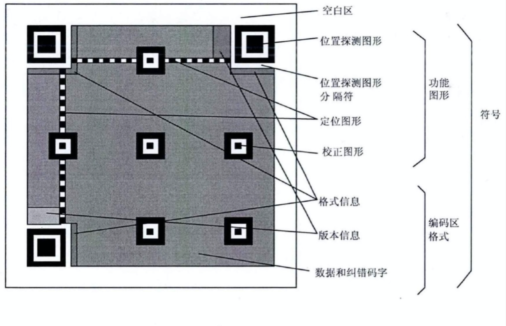

### ZXing二维码识别过程及优化
#### 二维码的简单介绍
- 二维码又称二维条码，常见的二维码为QR Code，QR全称Quick Response
- 二维码使用四种标准化编码模式（数字、字母数字、字节（二进制）和日文（Shift_JIS））来存储数据
- 二维码一共有40个不同的版本，版本1为21×21矩阵，每增加一个版本，长宽各增加4的尺寸，最大的版本40为177×177矩阵
- QR码有容错能力，QR码图形如果有破损，仍然可以被机器读取内容，最高可以到30%面积破损仍可被读取
- 下面是一个二维码的案例
      
      
#### ZXing识别二维码的核心流程
 - ZXLuminanceSource
 - 裁剪图片
 - 提取图片RGBA值并转换为灰度值
 - ZXHybridBinarizer
 - 对上一步的灰度值进行直方图均衡化
 - 根据灰度值对数据二值化
 - ZXQRCodeDetector
 - 确定二维码的位置信息
 - ZXQRCodeFinderPatternFinder   找到定位图案
 - ZXQRCodeAlignmentPatternFinder 版本2以上才有，进一步定位二维码的位置
 - ZXQRCodeDecoder
 - 对二维码的二值化数据进行解析，获取二维码
 - ZXQRCodeVersion 解析版本信息
 - ZXQRCodeFormatInformation 解析格式信息
 - ZXQRCodeErrorCorrectionLevel 解析纠错等级

#### ZXing扫描优化
- 减少解码格式
 - ZXing默认支持很多种格式，所以我们在实践过程中可以根据实际减少解码样式，提高解码速度，如果app实际只有二维码扫码，甚至可以只保留QR Code这一种解码格式
             
```objc
- (ZXResult *)decodeInternal:(ZXBinaryBitmap *)image error:(NSError **)error {
  if (self.readers != nil) {
    for (id<ZXReader> reader in self.readers) {
      ZXResult *result = [reader decode:image hints:self.hints error:nil];
      if (result) {
        return result;
      }
    }
  }

  if (error) *error = ZXNotFoundErrorInstance();
  return nil;
}
```

- 自动放大
 - 当ZXQRCodeDetector确定二维码的位置后，就可以知道二维码的大小，如果二维码过小，即使检测到了二维码的存在，在后面的解析二维码也很有可能失败，因此可以根据二维码的大小调整焦距