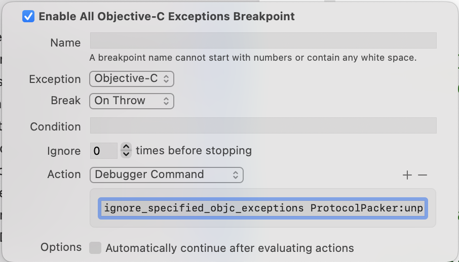

### 忽略特殊的异常断点

在开发调试过程中，有些第三方的 `SDK` 因为某些原因会抛出一些异常，被 `Xcode's All Exceptions breakpoint` 所截获，但是这可能不是我们想要关注的断点，所以每次调试的时候都会在这里断住，影响开发效率。

所以写了一个 `python` 脚本来解决这个问题，使用步骤如下

#### 下载忽略断点的解析脚本

 1. 将 `ignore_specified_objc_exceptions.py` 下载到本地
 2. 在 `~/.lldbinit` 中增加 `command script import ~/Library/lldb/ignore_specified_objc_exceptions.py `
 3. 把 `~/Library/lldb/ignore_specified_objc_exceptions.py` 换成 `1` 下载的本地路径

#### 编辑异常断点
 1. 将 `Breakpoints_v2.xcbkptlist` 文件下载到本地， 替换 `~/Library/Developer/Xcode/UserData/xcdebugger` 文件中的 `Breakpoints_v2.xcbkptlist`
 
 2. 打开 `Xcode` ，编辑 `Exceptions breakpoint` ， 以 `待过滤异常断点文件名:待过滤异常断点方法名` 的形式把下图 `Debugger Command` 中的 `ignore_specified_objc_exceptions ProtocolPacker:unpack` 替换成 `ignore_specified_objc_exceptions 待过滤异常断点文件名:待过滤异常断点方法名`
  